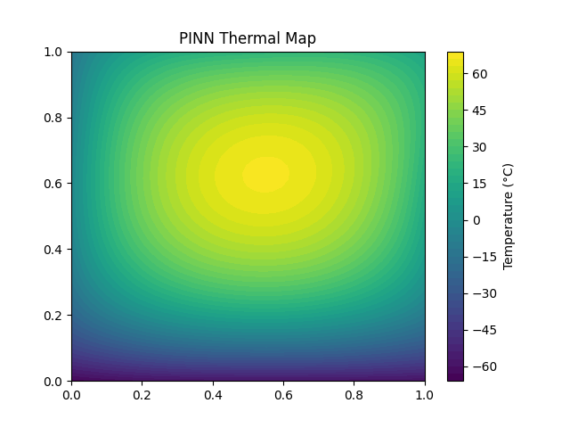
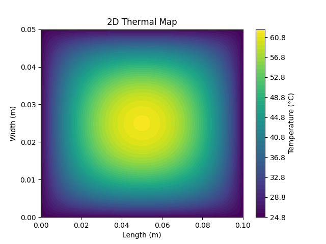
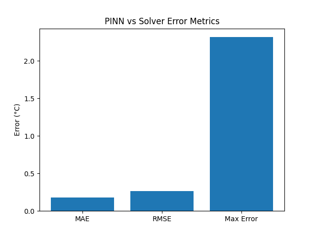

# ThermoPINN API

Physics-informed neural network for real-time thermal prediction in engineering systems.

**Live API:** https://thermopinn-api.onrender.com/docs



---

## What makes this project different

Most ML projects:

- train a model
- report accuracy
- stop at a notebook

This project:

- integrates physics and machine learning
- compares against a numerical heat solver
- benchmarks performance
- exposes the model through FastAPI
- is deployed as a live cloud API on Render

This is closer to a real engineering ML system than a typical ML demo.

---

## Why this project matters

Thermal management is a critical constraint in modern engineering systems such as:

- electric vehicles
- batteries
- electronics
- data centers

Traditional numerical solvers are accurate but too slow for real-time applications such as optimization loops, design exploration, monitoring systems, or API-based deployment.

This project demonstrates an end-to-end engineering ML system that combines:

- physics-based simulation
- neural network approximation
- benchmark validation
- FastAPI model serving
- cloud deployment with Render

---

## Key Results

| Metric | Value |
|--------|------:|
| MAE | 0.18 °C |
| RMSE | 0.26 °C |
| Max Error | 2.32 °C |
| Solver time | ~0.13 s |
| PINN inference time | ~0.036 s |
| Speedup | ~3.5x |

Note: Small boundary deviations are expected due to neural approximation.

---

## Engineering Insight

This project demonstrates:

- using physics to reduce data requirements
- replacing expensive simulations with learned surrogates
- building real-time prediction systems
- bridging mechanical engineering and machine learning

Potential use cases:

- battery thermal management
- real-time simulation acceleration
- optimization loops
- digital twins
- electronics cooling

---

## Architecture

```text
Numerical Heat Solver
↓
Ground Truth Temperature Field
↓
PINN Training
↓
Model Inference
↓
FastAPI Endpoints
↓
Render Deployment
```

The numerical solver generates the reference temperature field.
The PINN learns an approximation of that field.
The trained model is exposed through FastAPI and deployed as a live API on Render.

---

## Tech Stack

- Python
- PyTorch
- FastAPI
- NumPy
- Matplotlib
- Render

---

## Features

- 2D steady-state heat equation solver
- Thermal map generation
- PINN model training
- Normalized supervised learning
- PINN vs solver benchmark metrics
- FastAPI prediction endpoints
- Live deployed API on Render

---

## API Endpoints

### Health check

```http
GET /health
```

### Run physics simulation

```http
POST /simulate
```

Example request:

```json
{
"length": 0.1,
"width": 0.05,
"heat_power": 100000,
"ambient_temperature": 25
}
```

### Predict with PINN

```http
POST /predict-pinn
```

Example request:

```json
{
"x": 0.5,
"y": 0.5
}
```

Example response:

```json
{
"x": 0.5,
"y": 0.5,
"predicted_temperature": 62.09
}
```

---

## Try it yourself

Open the live API documentation:

https://thermopinn-api.onrender.com/docs

Test the `/predict-pinn` endpoint with:

```json
{
"x": 0.5,
"y": 0.5
}
```

---

## Visualizations

### Numerical solver thermal map



### PINN thermal map


### PINN vs solver error metrics



---

## Local Setup

Clone the repository:

```bash
git clone https://github.com/hassanattout/thermopinn-api.git
cd thermopinn-api
```

Create and activate a virtual environment:

```bash
python3 -m venv venv
source venv/bin/activate
```

Install dependencies:

```bash
pip install -r requirements.txt
```

Run the API locally:

```bash
python -m uvicorn app.main:app --reload
```

Open:

```text
http://127.0.0.1:8000/docs
```

---

## Deployment on Render

This project is deployed as a Python web service on Render.

Build command:

```bash
pip install -r requirements.txt
```

Start command:

```bash
python -m uvicorn app.main:app --host 0.0.0.0 --port $PORT
```

The `$PORT` variable is provided automatically by Render.

---

## Project Structure

```text
thermopinn-api/
├── app/
│ └── main.py
├── fem/
│ ├── heat_solver_2d.py
│ └── visualize.py
├── pinn/
│ ├── model.py
│ ├── train.py
│ ├── inference.py
│ └── visualize_pinn.py
├── experiments/
│ ├── compare_pinn_vs_solver.py
│ └── generate_benchmark_artifacts.py
├── models/
│ └── pinn_model.pth
├── results/
│ ├── thermal_map.png
│ ├── pinn_thermal_map.png
│ ├── error_metrics.png
│ └── benchmark_metrics.csv
├── requirements.txt
├── runtime.txt
└── README.md
```

---

## Future Improvements

- 3D thermal modeling
- transient heat equation
- CAD-based inputs
- battery pack geometry
- improved physics loss integration
- GPU inference
- advanced deployment pipeline
- `/predict-grid` endpoint for full-field PINN prediction

---

## Author

Hassan Attout
Mechanical & Energy Engineering
AI for Engineering Systems
