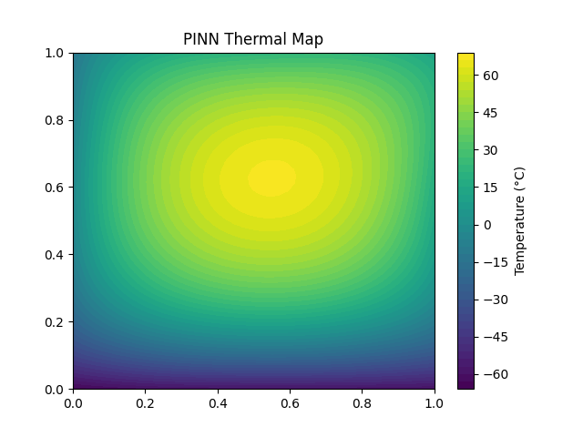
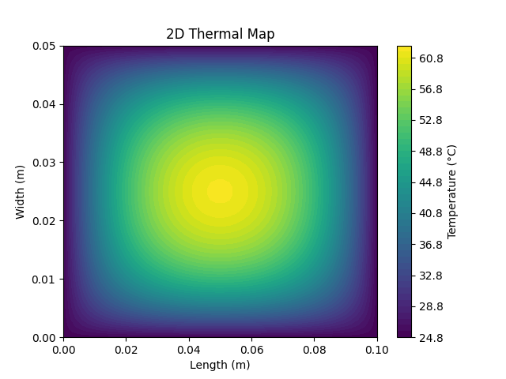
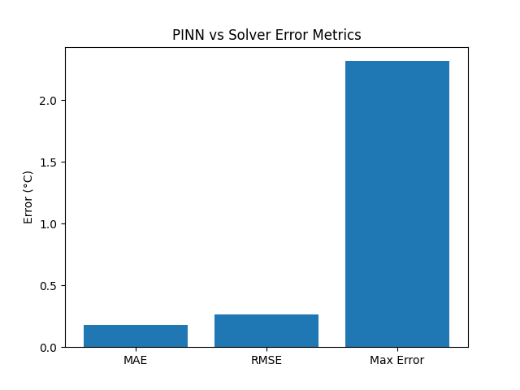

# ThermoPINN API

Thermal neural-surrogate API for real-time prediction in engineering systems, with an experimental physics-informed training module.

**Live API:** https://thermopinn-api.onrender.com/docs



---

## What makes this project different

Most ML projects:

- train a model
- report accuracy
- stop at a notebook

This project:

- combines a numerical heat solver with a learned surrogate
- compares against a numerical heat solver
- benchmarks performance
- exposes the model through FastAPI
- is deployed as a live cloud API on Render

This is closer to a real engineering ML system than a typical ML demo.

---

## Why this project matters

Thermal management is a critical constraint in modern engineering systems such as:

- electric vehicles
- batteries
- electronics
- data centers

Traditional numerical solvers are accurate but too slow for real-time applications such as optimization loops, design exploration, monitoring systems, or API-based deployment.

This project demonstrates an end-to-end engineering ML system that combines:

- physics-based reference simulation
- supervised neural-network approximation
- benchmark validation
- FastAPI model serving
- cloud deployment with Render

---

## Key Results

| Metric | Value |
|--------|------:|
| MAE | 0.18 °C |
| RMSE | 0.26 °C |
| Max Error | 2.32 °C |
| Solver time | ~0.13 s |
| PINN inference time | ~0.036 s |
| Speedup | ~3.5x |

Note: Small boundary deviations are expected due to neural approximation.

These figures are benchmark artifacts for the fixed demonstration geometry and
boundary conditions committed to this repository. They are not a claim of
accuracy across arbitrary geometries or operating conditions.

### Model-scope clarification

The released `models/pinn_model.pth` checkpoint is trained in `pinn/train.py`
using supervised targets generated by the numerical solver. The repository also
contains an experimental PDE residual in `pinn/loss.py`, but that residual is
not used to train the released checkpoint. Accordingly, the deployed model is
described here as a thermal neural surrogate, not as a fully physics-informed
model. Integrating and validating the physics residual is future work.

---

## Engineering Insight

This project demonstrates:

- using physics to reduce data requirements
- replacing expensive simulations with learned surrogates
- building real-time prediction systems
- bridging mechanical engineering and machine learning

Potential use cases:

- battery thermal management
- real-time simulation acceleration
- optimization loops
- digital twins
- electronics cooling

---

## Architecture

```text
Numerical Heat Solver
↓
Ground Truth Temperature Field
↓
Supervised Surrogate Training
↓
Surrogate Inference
↓
FastAPI Endpoints
↓
Render Deployment
```

The numerical solver generates the reference temperature field.
The neural surrogate learns an approximation of that field.
The trained model is exposed through FastAPI and deployed as a live API on Render.

---

## Tech Stack

- Python
- PyTorch
- FastAPI
- NumPy
- Matplotlib
- Render

---

## Features

- 2D steady-state heat equation solver
- Thermal map generation
- supervised thermal-surrogate training
- experimental physics-loss implementation
- Normalized supervised learning
- PINN vs solver benchmark metrics
- FastAPI prediction endpoints
- Live deployed API on Render

---

## API Endpoints

### Health check

```http
GET /health
```

### Run physics simulation

```http
POST /simulate
```

Example request:

```json
{
"length": 0.1,
"width": 0.05,
"heat_power": 100000,
"ambient_temperature": 25
}
```

### Predict with the thermal surrogate

```http
POST /predict-pinn
```

Example request:

```json
{
"x": 0.5,
"y": 0.5
}
```

Example response:

```json
{
"x": 0.5,
"y": 0.5,
"predicted_temperature": 62.09
}
```

---

## Try it yourself

Open the live API documentation:

https://thermopinn-api.onrender.com/docs

Test the `/predict-pinn` endpoint with:

```json
{
"x": 0.5,
"y": 0.5
}
```

---

## Visualizations

### Numerical solver thermal map



### PINN thermal map


### PINN vs solver error metrics



---

## Local Setup

Clone the repository:

```bash
git clone https://github.com/hassanattout/thermopinn-api.git
cd thermopinn-api
```

Create and activate a virtual environment:

```bash
python3 -m venv venv
source venv/bin/activate
```

Install dependencies:

```bash
pip install -r requirements.txt
```

Run the API locally:

```bash
python -m uvicorn app.main:app --reload
```

Open:

```text
http://127.0.0.1:8000/docs
```

---

## Deployment on Render

This project is deployed as a Python web service on Render.

Build command:

```bash
pip install -r requirements.txt
```

Start command:

```bash
python -m uvicorn app.main:app --host 0.0.0.0 --port $PORT
```

The `$PORT` variable is provided automatically by Render.

## Docker

Build and run the API locally:

```bash
docker build -t thermopinn-api .
docker run --rm -p 8000:8000 thermopinn-api
```

Then open `http://127.0.0.1:8000/docs`.

## Configuration

Cross-origin access is restricted by default to the local Streamlit address.
Provide a comma-separated allowlist when another browser origin needs access:

```bash
export THERMOPINN_CORS_ORIGINS="https://example.com,http://localhost:8501"
```

## Automated Tests

Run the same checks used by GitHub Actions:

```bash
./run_checks.sh
```

---

## Production API Endpoints

| Method | Endpoint | Purpose |
|--------|----------|---------|
| GET | `/health` | Check API and model status |
| POST | `/simulate` | Run FEM thermal simulation |
| GET | `/thermal-map` | Return generated FEM heatmap |
| POST | `/predict-pinn` | Predict temperature at one point |
| POST | `/predict-batch` | Predict temperature at multiple points |
| POST | `/predict-grid` | Predict full thermal field on a grid |
| POST | `/compare` | Compare the FEM solver against the neural surrogate |
| GET | `/metrics` | Download benchmark metrics |

The `/compare` endpoint is the core demonstration layer. It measures how the
released surrogate compares with the numerical solver for the API request. It
is not an independent test-set validation.

---

## Limitations

- The released checkpoint is a supervised surrogate for one simplified 2D steady-state thermal field.
- Boundary conditions and geometry are intentionally simplified for this prototype.
- The reported benchmark is not an independent generalization study.
- The API is designed as an engineering ML demonstration, not a production-certified solver.

---

## Future Improvements

- 3D thermal modeling
- transient heat equation
- CAD-based inputs
- battery pack geometry
- integrate the physics residual into training and validate it independently
- GPU inference
- advanced deployment pipeline
- independent train, validation, and test geometries

---

## Author

Hassan Attout  
Mechanical & Energy Engineering  
AI for Engineering Systems

---

## Collaboration

This project demonstrates engineering + ML integration through a structured workflow.

---

## Note

This project follows a structured workflow.
